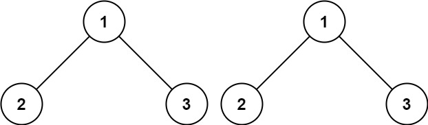
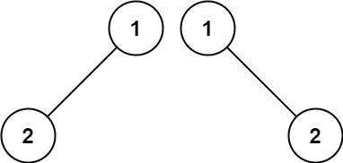
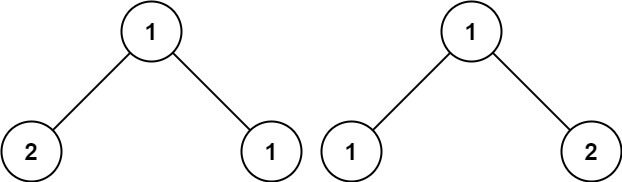

[100. Same Tree](https://leetcode.com/problems/same-tree/description/)

Given the roots of two binary trees p and q, write a function to check if they are the same or not.

Two binary trees are considered the same if they are structurally identical, and the nodes have the same value.

**Example 1:**



Input: p = [1,2,3], q = [1,2,3]
Output: true

**Example 2:**



Input: p = [1,2], q = [1,null,2]
Output: false

**Example 3:**



Input: p = [1,2,1], q = [1,1,2]
Output: false

**Constraints:**

- The number of nodes in both trees is in the range [0, 100].
- -10^4 <= Node.val <= 10^4

## Code

```py
# Definition for a binary tree node.
class TreeNode:
    def __init__(self, val=0, left=None, right=None):
        self.val = val
        self.left = left
        self.right = right

class Solution:
    def isSameTree(self, p: Optional[TreeNode], q: Optional[TreeNode]) -> bool:
        stack = [(p, q)]

        while stack:
            n, m = stack.pop()

            if not n and not m:
                continue
            elif None in [n, m]:
                return False
            else:
                if n.val != m.val:
                    return False
                stack.append((n.right, m.right))
                stack.append((n.left, m.left))

        return True
```

```py
# Definition for a binary tree node.
class TreeNode:
    def __init__(self, val=0, left=None, right=None):
        self.val = val
        self.left = left
        self.right = right


class Solution:
    def isSameTree(self, p: Optional[TreeNode], q: Optional[TreeNode]) -> bool:
        if p == None or q == None:
            return p == q

        if p.val != q.val:
            return False

        return self.isSameTree(p.left, q.left) and self.isSameTree(p.right, q.right)
```

```go

package sametree

//   Definition for a binary tree node.
type TreeNode struct {
	Val int
	Left *TreeNode
	Right *TreeNode
}

func isSameTree(p *TreeNode, q *TreeNode) bool {
	type StackNode struct {
		n *TreeNode
		m *TreeNode
	}
	stack := []StackNode{
		{p, q},
	}

	for len(stack) > 0 {
		node := stack[len(stack)-1]
		stack = stack[:len(stack)-1]

		if node.n == nil && node.m == nil {
			continue
		} else if node.n == nil || node.m == nil {
			return false
		} else {
			if node.n.Val != node.m.Val {
				return false
			}

			stack = append(stack, StackNode{node.n.Right, node.m.Right})
			stack = append(stack, StackNode{node.n.Left, node.m.Left})
		}

	}

	return true
}

```

```go
package sametree

/**
 * Definition for a binary tree node.
 * type TreeNode struct {
 *     Val int
 *     Left *TreeNode
 *     Right *TreeNode
 * }
 */
func isSameTreeRecursive(p *TreeNode, q *TreeNode) bool {
    if p == nil || q == nil {
        return p == q
    }

    if p.Val != q.Val {
        return false
    }

    return isSameTree(p.Left, q.Left) && isSameTree(p.Right, q.Right)
}

```
