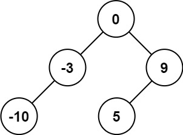
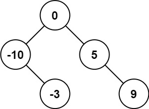

[108. Convert Sorted Array to Binary Search Tree](https://leetcode.com/problems/convert-sorted-array-to-binary-search-tree/description/)

Given an integer array `nums` where the elements are sorted in **ascending order**, convert _it to a **height-balanced** binary search tree_.

**Example 1:**



**Input**: nums = [-10,-3,0,5,9]
**Output**: [0,-3,9,-10,null,5]
**Explanation**: [0,-10,5,null,-3,null,9] is also accepted:



**Example 2:**


**Input**: nums = [1,3]
**Output**: [3,1]
**Explanation**: [1,null,3] and [3,1] are both height-balanced BSTs.

**Constraints:**

- `1 <= nums.length <= 104`
- `-104 <= nums[i] <= 104`
- `nums` is sorted in a **strictly increasing** order.

**Code:**

```ts
/**
 * Definition for a binary tree node.
 * class TreeNode {
 *     val: number
 *     left: TreeNode | null
 *     right: TreeNode | null
 *     constructor(val?: number, left?: TreeNode | null, right?: TreeNode | null) {
 *         this.val = (val===undefined ? 0 : val)
 *         this.left = (left===undefined ? null : left)
 *         this.right = (right===undefined ? null : right)
 *     }
 * }
 */

function sortedArrayToBST(nums: number[]): TreeNode | null {
  const n = nums.length;
  if (n === 0) return null;

  const mid = Math.floor(n / 2);

  let root = new TreeNode(nums[mid]);

  root.left = sortedArrayToBST(nums.slice(0, mid));
  root.right = sortedArrayToBST(nums.slice(mid + 1));

  return root;
}
```

```py

from typing import List, Optional


# Definition for a binary tree node.
class TreeNode:
    def __init__(self, val=0, left=None, right=None):
        self.val = val
        self.left = left
        self.right = right


class Solution:
    def sortedArrayToBST(self, nums: List[int]) -> Optional[TreeNode]:
        if not nums:
            return None
        mid = len(nums) // 2

        root = TreeNode(nums[mid])

        root.left = self.sortedArrayToBST(nums[:mid])
        root.right = self.sortedArrayToBST(nums[mid + 1 :])

        return root

```

```go

/**
 * Definition for a binary tree node.
 * type TreeNode struct {
 *     Val int
 *     Left *TreeNode
 *     Right *TreeNode
 * }
 */
func sortedArrayToBST(nums []int) *TreeNode {
	n := len(nums)

	if n == 0 {
		return nil
	}

	mid := n / 2

	root := &TreeNode{Val: nums[mid]}

    root.Left = sortedArrayToBST(nums[:mid])
    root.Right = sortedArrayToBST(nums[mid + 1:])

	return root
}

```

```java

/**
 * Definition for a binary tree node.
 * public class TreeNode {
 *     int val;
 *     TreeNode left;
 *     TreeNode right;
 *     TreeNode() {}
 *     TreeNode(int val) { this.val = val; }
 *     TreeNode(int val, TreeNode left, TreeNode right) {
 *         this.val = val;
 *         this.left = left;
 *         this.right = right;
 *     }
 * }
 */
class Solution {
    public TreeNode sortedArrayToBST(int[] nums) {
        int n = nums.length;

        if (n == 0)
            return null;

        int mid = n / 2;

        TreeNode root = new TreeNode(nums[mid]);

        root.left = sortedArrayToBST(Arrays.copyOfRange(nums, 0, mid));
        root.right = sortedArrayToBST(Arrays.copyOfRange(nums, mid + 1, n));

        return root;
    }
}

```
