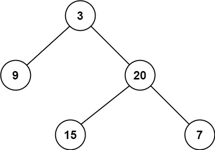

[111. Minimum Depth of Binary Tree](https://leetcode.com/problems/minimum-depth-of-binary-tree/description/)

Given a binary tree, find its minimum depth.

The minimum depth is the number of nodes along the shortest path from the root node down to the nearest leaf node.

Note: A leaf is a node with no children.

**Example 1:**


Input: root = [3,9,20,null,null,15,7]
Output: 2


**Example 2:**

Input: root = [2,null,3,null,4,null,5,null,6]
Output: 5

**Constraints:**

The number of nodes in the tree is in the range [0, 105].
-1000 <= Node.val <= 1000

**Code:**

```go

package main

type TreeNode struct {
	Val   int
	Left  *TreeNode
	Right *TreeNode
}

func minDepth(root *TreeNode) int {
	if root == nil {
		return 0
	}

	left := minDepth(root.Left)
	right := minDepth(root.Right)

	if left == 0 || right == 0 {
		return left + right + 1
	}

	return min(left, right) + 1
}

```
