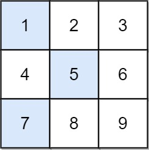

# [1289. Minimum Falling Path Sum II](https://leetcode.com/problems/minimum-falling-path-sum-ii/description/?envType=daily-question&envId=2024-04-26)

Given an `n x n` integer matrix `grid`, return the \*minimum sum of a **falling path with non-zero shifts\***.

A falling path with non-zero shifts is a choice of exactly one element from each row of grid such that no two elements chosen in adjacent rows are in the same column.

## Example 1:



```

Input: grid = [[1,2,3],[4,5,6],[7,8,9]]
Output: 13
Explanation:
The possible falling paths are:
[1,5,9], [1,5,7], [1,6,7], [1,6,8],
[2,4,8], [2,4,9], [2,6,7], [2,6,8],
[3,4,8], [3,4,9], [3,5,7], [3,5,9]
The falling path with the smallest sum is [1,5,7], so the answer is 13.

```

## Example 2:

```
Input: grid = [[7]]
Output: 7
```

## Constraints:

- `n == grid.length == grid[i].length`
- `1 <= n <= 200`
- `-99 <= grid[i][j] <= 99`

# Code

```python

class Solution:
        def minFallingPathSum(self, A):
            for i in range(1, len(A)):
                r = heapq.nsmallest(2, A[i - 1])
                for j in range(len(A[0])):
                    A[i][j] += r[1] if A[i - 1][j] == r[0] else r[0]
            return min(A[-1])

```
