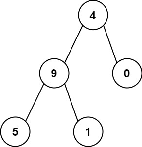

# [129. Sum Root to Leaf Numbers](https://leetcode.com/problems/sum-root-to-leaf-numbers/description/?envType=daily-question&envId=2024-04-15)

You are given the `root` of a binary tree containing digits from `0` to `9` only.

Each root-to-leaf path in the tree represents a number.

- For example, the root-to-leaf path `1 -> 2 -> 3` represents the number `123`.

Return _the total sum of all root-to-leaf numbers_. Test cases are generated so that the answer will fit in a **32-bit** integer.

A **leaf** node is a node with no children.

## Example 1:


```
Input: root = [1,2,3]
Output: 25
Explanation:
The root-to-leaf path 1->2 represents the number 12.
The root-to-leaf path 1->3 represents the number 13.
Therefore, sum = 12 + 13 = 25.
```

## Example 2:



```
Input: root = [4,9,0,5,1]
Output: 1026
Explanation:
The root-to-leaf path 4->9->5 represents the number 495.
The root-to-leaf path 4->9->1 represents the number 491.
The root-to-leaf path 4->0 represents the number 40.
Therefore, sum = 495 + 491 + 40 = 1026.
```

## Constraints:

- The number of nodes in the tree is in the range `[1, 1000]`.
- `0 <= Node.val <= 9`
- The depth of the tree will not exceed `10`.

# Code

**Recursive**

```python

# Definition for a binary tree node.
# class TreeNode:
#     def __init__(self, val=0, left=None, right=None):
#         self.val = val
#         self.left = left
#         self.right = right
class Solution:
    def sumNumbers(self, root: Optional[TreeNode]) -> int:
        def traverse(root: Optional[TreeNode], current: int):
            if not root:
                return 0
            current = current * 10 + root.val
            if not root.left and not root.right:
                return current
            return traverse(root.left, current) + traverse(root.right, current)

        return traverse(root, 0)

```

**Stack**

```python

# Definition for a binary tree node.
# Definition for a binary tree node.
# class TreeNode:
#     def __init__(self, val=0, left=None, right=None):
#         self.val = val
#         self.left = left
#         self.right = right
class Solution:
    def sumNumbers(self, root: Optional[TreeNode]) -> int:
        res = 0

        stack = [(root, 0)]

        while stack:
            root, current = stack.pop()
            current = current * 10 + root.val
            if not root.left and not root.right:
                res += current
            if root.left:
                stack.append((root.left, current))
            if root.right:
                stack.append((root.right, current))

        return res

```
