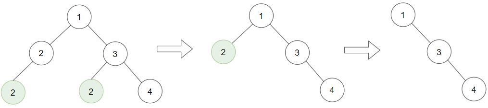

# [1325. Delete Leaves With a Given Value](https://leetcode.com/problems/delete-leaves-with-a-given-value/description/?envType=daily-question&envId=2024-05-17)

Given a binary tree `root` and an integer `target`, delete all the leaf nodes with value `target`.

Note that once you delete a leaf node with value `target`, if its parent node becomes a leaf node and has the value `target`, it should also be deleted (you need to continue doing that until you cannot).

## Example 1:



```

Input: root = [1,2,3,2,null,2,4], target = 2
Output: [1,null,3,null,4]
Explanation: Leaf nodes in green with value (target = 2) are removed (Picture in left).
After removing, new nodes become leaf nodes with value (target = 2) (Picture in center).

```


## Example 2:

```

Input: root = [1,3,3,3,2], target = 3
Output: [1,3,null,null,2]

```

## Example 3:


```

Input: root = [1,2,null,2,null,2], target = 2
Output: [1]
Explanation: Leaf nodes in green with value (target = 2) are removed at each step.

```

## Constraints:

- The number of nodes in the tree is in the range `[1, 3000]`.
- `1 <= Node.val, target <= 1000`

# Code

## Recursive

```python

# Definition for a binary tree node.
# class TreeNode:
#     def __init__(self, val=0, left=None, right=None):
#         self.val = val
#         self.left = left
#         self.right = right
class Solution:
    def removeLeafNodes(self, root: Optional[TreeNode], target: int) -> Optional[TreeNode]:
        if root.left:
            left = self.removeLeafNodes(root.left, target)
            root.left = left
        if root.right:
            right = self.removeLeafNodes(root.right, target)
            root.right = right

        if root.val == target and root.left == root.right:
            return None
        else:
            return root

        return root

```

```java

/**
 * Definition for a binary tree node.
 * public class TreeNode {
 * int val;
 * TreeNode left;
 * TreeNode right;
 * TreeNode() {}
 * TreeNode(int val) { this.val = val; }
 * TreeNode(int val, TreeNode left, TreeNode right) {
 * this.val = val;
 * this.left = left;
 * this.right = right;
 * }
 * }
 */
class Solution {
    public TreeNode removeLeafNodes(TreeNode root, int target) {
        if (root.left != null) {
            root.left = removeLeafNodes(root.left, target);
        }
        if (root.right != null) {
            root.right = removeLeafNodes(root.right, target);
        }
        if (root.left == root.right && root.val == target) {
            return null;
        } else {
            return root;
        }
    }
}

```

```go

/**
 * Definition for a binary tree node.
 * type TreeNode struct {
 *     Val int
 *     Left *TreeNode
 *     Right *TreeNode
 * }
 */
func removeLeafNodes(root *TreeNode, target int) *TreeNode {
	if root.Left != nil {
		root.Left = removeLeafNodes(root.Left, target)
	}

	if root.Right != nil {
		root.Right = removeLeafNodes(root.Right, target)
	}

	if root.Left == root.Right && root.Val == target {
		return nil
	} else {
		return root
	}
}

```

```cpp

/**
 * Definition for a binary tree node.
 * struct TreeNode {
 *     int val;
 *     TreeNode *left;
 *     TreeNode *right;
 *     TreeNode() : val(0), left(nullptr), right(nullptr) {}
 *     TreeNode(int x) : val(x), left(nullptr), right(nullptr) {}
 *     TreeNode(int x, TreeNode *left, TreeNode *right) : val(x), left(left),
 * right(right) {}
 * };
 */
class Solution {
public:
    TreeNode* removeLeafNodes(TreeNode* root, int target) {
        if (root->left) {
            root->left = removeLeafNodes(root->left, target);
        }
        if (root->right) {
            root->right = removeLeafNodes(root->right, target);
        }

        if (root->left == root->right && root->val == target) {
            return 0;
        } else {
            return root;
        }
    }
};

```

```c

/**
 * Definition for a binary tree node.
 * struct TreeNode {
 *     int val;
 *     struct TreeNode *left;
 *     struct TreeNode *right;
 * };
 */
struct TreeNode* removeLeafNodes(struct TreeNode* root, int target) {
    if (root -> left) {
        root -> left = removeLeafNodes(root -> left, target);
    }
    if (root -> right) {
        root -> right = removeLeafNodes(root -> right, target);
    }

    if (root -> left == root -> right && root -> val == target) {
        return 0;
    } else {
        return root;
    }
}

```

```ts
/**
 * Definition for a binary tree node.
 * class TreeNode {
 *     val: number
 *     left: TreeNode | null
 *     right: TreeNode | null
 *     constructor(val?: number, left?: TreeNode | null, right?: TreeNode | null) {
 *         this.val = (val===undefined ? 0 : val)
 *         this.left = (left===undefined ? null : left)
 *         this.right = (right===undefined ? null : right)
 *     }
 * }
 */

function removeLeafNodes(
  root: TreeNode | null,
  target: number
): TreeNode | null {
  if (root.left != null) {
    root.left = removeLeafNodes(root.left, target);
  }
  if (root.right != null) {
    root.right = removeLeafNodes(root.right, target);
  }
  if (root.left == root.right && root.val == target) {
    return null;
  } else {
    return root;
  }
}
```
