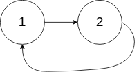

# [141. Linked List Cycle](https://leetcode.com/problems/linked-list-cycle/description/5)

Given the `head` of a linked list, return _the node where the cycle begins_. _If there is no cycle, return_ `null`.

There is a cycle in a linked list if there is some node in the list that can be reached again by continuously following the `next` pointer. Internally, `pos` is used to denote the index of the node that tail's `next` pointer is connected to (**0-indexed**). It is `-1` if there is no cycle. **Note that `pos` is not passed as a parameter.**

**Do not modify** the linked list.

## Example 1:


```
Input: head = [3,2,0,-4], pos = 1
Output: tail connects to node index 1
Explanation: There is a cycle in the linked list, where tail connects to the second node.
```

## Example 2:



```
Input: head = [1,2], pos = 0
Output: tail connects to node index 0
Explanation: There is a cycle in the linked list, where tail connects to the first node.
```

## Example 3:


```
Input: head = [1], pos = -1
Output: no cycle
Explanation: There is no cycle in the linked list.
```

## Constraints:

- The number of the nodes in the list is in the range `[0, 10^4]`.
- `-10^5 <= Node.val <= 10^5`
- `pos` is `-1` or a valid index in the linked-list.

**Follow-up:** Can you solve it using `O(1)` (i.e. constant) memory?

```py

# Definition for singly-linked list.
# class ListNode:
#     def __init__(self, x):
#         self.val = x
#         self.next = None

class Solution:
    def detectCycle(self, head: Optional[ListNode]) -> Optional[ListNode]:
        slow = fast = head

        while fast != None and fast.next != None:
            slow = slow.next
            fast = fast.next.next
            if slow == fast:
                break

        if fast == None or fast.next == None:
            return None

        slow = head
        while fast != slow:
            slow = slow.next
            fast = fast.next

        return slow
```

```java

/**
 * Definition for singly-linked list.
 * class ListNode {
 * int val;
 * ListNode next;
 * ListNode(int x) {
 * val = x;
 * next = null;
 * }
 * }
 */
public class Solution {
    public ListNode detectCycle(ListNode head) {
        ListNode slow = head;
        ListNode fast = head;

        while (fast != null && fast.next != null) {
            fast = fast.next.next;
            slow = slow.next;
            if (fast == slow) {
                break;
            }
        }

        if (fast == null || fast.next == null) {
            return null;
        }

        while (head != fast) {
            head = head.next;
            fast = fast.next;
        }

        return head;
    }
}

```
