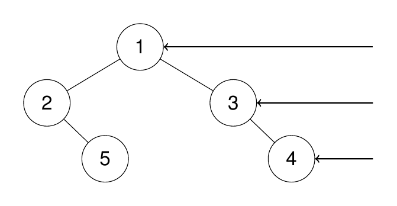
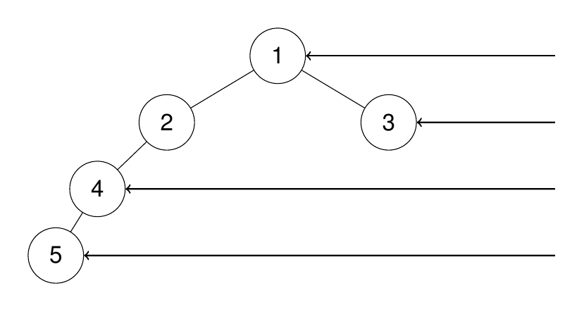

[199. Binary Tree Right Side View](https://leetcode.com/problems/binary-tree-right-side-view/description/)

Given the root of a binary tree, imagine yourself standing on the right side of it, return the values of the nodes you can see ordered from top to bottom.

**Example 1:**

**Input**
Input: root = [1,2,3,null,5,null,4]

Output: [1,3,4]

Explanation:



**Example 1:**

**Input**
Input: root = [1,2,3,4,null,null,null,5]

Output: [1,3,4,5]

Explanation:



**Constraints:**

The number of nodes in the tree is in the range [0, 100].
-100 <= Node.val <= 100

```py

# Definition for a binary tree node.
# class TreeNode:
#     def __init__(self, val=0, left=None, right=None):
#         self.val = val
#         self.left = left
#         self.right = right
class Solution:
    def rightSideView(self, root: Optional[TreeNode]) -> List[int]:
        res = []

        self.dfs(root, 0, res)

        return res

    def dfs(self, root: Optional[TreeNode], level: int, res: List[int]):
        if root:
            if len(res) <= level:
                res.append(root.val)
            res[level] = root.val
            self.dfs(root.left, level + 1, res)
            self.dfs(root.right, level + 1, res)

        return

```

```ts
/**
 * Definition for a binary tree node.
 * class TreeNode {
 *     val: number
 *     left: TreeNode | null
 *     right: TreeNode | null
 *     constructor(val?: number, left?: TreeNode | null, right?: TreeNode | null) {
 *         this.val = (val===undefined ? 0 : val)
 *         this.left = (left===undefined ? null : left)
 *         this.right = (right===undefined ? null : right)
 *     }
 * }
 */

function rightSideView(root: TreeNode | null): number[] {
  const res = [];

  dfs(root, 0, res);

  return res;
}

function dfs(root: TreeNode | null, level: number, res: number[]) {
  if (root) {
    if (res.length <= level) res.push(root.val);

    res[level] = root.val;

    dfs(root.left, level + 1, res);
    dfs(root.right, level + 1, res);
  }
}
```

```java

/**
 * Definition for a binary tree node.
 * public class TreeNode {
 * int val;
 * TreeNode left;
 * TreeNode right;
 * TreeNode() {}
 * TreeNode(int val) { this.val = val; }
 * TreeNode(int val, TreeNode left, TreeNode right) {
 * this.val = val;
 * this.left = left;
 * this.right = right;
 * }
 * }
 */
class Solution {
    public List<Integer> rightSideView(TreeNode root) {
        List<Integer> res = new ArrayList<>();

        dfs(root, 0, res);

        return res;
    }

    private void dfs(TreeNode root, int level, List<Integer> res) {
        if (root == null)
            return;

        if (res.size() <= level)
            res.add(root.val);

        res.set(level, root.val);

        dfs(root.left, level + 1, res);
        dfs(root.right, level + 1, res);
    }
}

```

```go

/**
 * Definition for a binary tree node.
 * type TreeNode struct {
 *     Val int
 *     Left *TreeNode
 *     Right *TreeNode
 * }
 */
func rightSideView(root *TreeNode) []int {
    res := make([]int, 0)

    dfs(root, 0, &res)

    return res
}

func dfs(root *TreeNode, level int, res *[]int) {
    if root != nil {
        if len(*res) <= level {
            *res = append(*res, root.Val)
        }

        (*res)[level] = root.Val

        dfs(root.Left, level + 1, res)
        dfs(root.Right, level + 1, res)
    }
}

```

```cpp

/**
 * Definition for a binary tree node.
 * struct TreeNode {
 *     int val;
 *     TreeNode *left;
 *     TreeNode *right;
 *     TreeNode() : val(0), left(nullptr), right(nullptr) {}
 *     TreeNode(int x) : val(x), left(nullptr), right(nullptr) {}
 *     TreeNode(int x, TreeNode *left, TreeNode *right) : val(x), left(left), right(right) {}
 * };
 */
class Solution {
public:
    vector<int> rightSideView(TreeNode* root) {
        vector<int> res;

        dfs(root, 0, res);

        return res;
    }

private:
    void dfs(TreeNode* root, int level, vector<int>& res) {
        if (root) {
            if (res.size() <= level) res.push_back(root->val);

            res[level] = root->val;

            dfs(root->left, level + 1, res);
            dfs(root->right, level + 1, res);
        }
    }
};

```

```cs

/**
 * Definition for a binary tree node.
 * public class TreeNode {
 *     public int val;
 *     public TreeNode left;
 *     public TreeNode right;
 *     public TreeNode(int val=0, TreeNode left=null, TreeNode right=null) {
 *         this.val = val;
 *         this.left = left;
 *         this.right = right;
 *     }
 * }
 */
public class Solution {
    public IList<int> RightSideView(TreeNode root) {
        IList<int> res = new List<int>();

        Dfs(root, 1, res);

        return res;
    }

    private void Dfs(TreeNode root, int level, IList<int> res) {
        if (root != null) {
            if (res.Count < level) {
                res.Add(root.val);
            }

            Dfs(root.right, level + 1, res);
            Dfs(root.left, level + 1, res);
        }
    }
}

```
