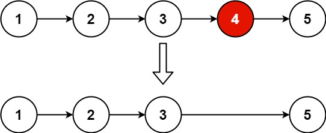

# [19. Remove Nth Node From End of List](https://leetcode.com/problems/remove-nth-node-from-end-of-list/description/)

Given the `head` of a linked list, remove the `nth` node from the end of the list and return its head.

## Example 1:



```

Input: head = [1,2,3,4,5], n = 2
Output: [1,2,3,5]

```

## Example 2:

```

Input: head = [1], n = 1
Output: []

```

## Example 3:

```

Input: head = [1,2], n = 1
Output: [1]

```

## Constraints:

- The number of nodes in the list is `sz`.
- `1 <= sz <= 30`
- `0 <= Node.val <= 100`
- `1 <= n <= sz`

# Code

```python

# Definition for singly-linked list.
# class ListNode:
#     def __init__(self, val=0, next=None):
#         self.val = val
#         self.next = next
class Solution:
    def removeNthFromEnd(self, head: Optional[ListNode], n: int) -> Optional[ListNode]:
        l = r = head

        for i in range(n):
            l = l.next

        if not l:
            return head.next

        while l.next:
            l = l.next
            r = r.next

        r.next = r.next.next
        return head

```

```rs

// Definition for singly-linked list.
// #[derive(PartialEq, Eq, Clone, Debug)]
// pub struct ListNode {
//   pub val: i32,
//   pub next: Option<Box<ListNode>>
// }
//
// impl ListNode {
//   #[inline]
//   fn new(val: i32) -> Self {
//     ListNode {
//       next: None,
//       val
//     }
//   }
// }
impl Solution {
    pub fn remove_nth_from_end(head: Option<Box<ListNode>>, n: i32) -> Option<Box<ListNode>> {
        let mut dummy = ListNode::new(0);
        dummy.next = head;

        let mut dummy = Box::new(dummy);
        let mut fast = dummy.clone();
        let mut slow =  dummy.as_mut();

        for _ in 0..n {
            fast = fast.next.unwrap();
        }

        while fast.next.is_some() {
            fast = fast.next.unwrap();
            slow = slow.next.as_mut().unwrap();
        }

        let next = slow.next.as_mut().unwrap();
        slow.next = next.next.clone();

        dummy.next
    }
}

```
