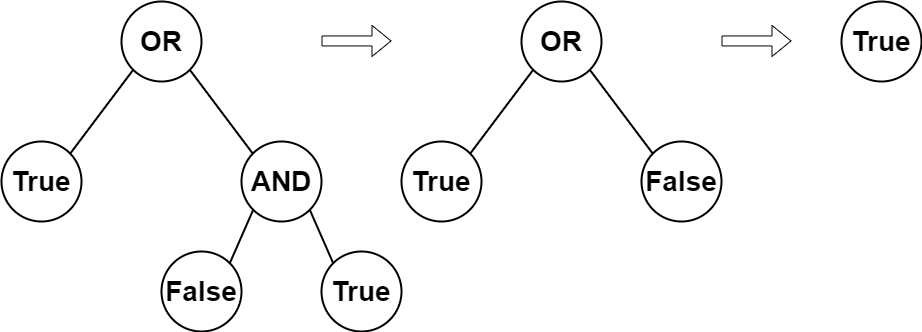

# [2215. Find the Difference of Two Arrays](https://leetcode.com/problems/find-the-difference-of-two-arrays/description/?envType=study-plan-v2&envId=leetcode-75)

You are given the `root` of a **full binary tree** with the following properties:

- Leaf nodes have either the value `0` or `1`, where `0` represents `False` and `1` represents `True`.
- **Non-leaf nodes** have either the value `2` or `3`, where `2` represents the boolean `OR` and `3` represents the boolean `AND`.

The **evaluation** of a node is as follows:

- If the node is a leaf node, the evaluation is the value of the node, i.e. `True` or `False`.
- Otherwise, **evaluate** the node's two children and apply the boolean operation of its value with the children's evaluations.

Return _the boolean result of evaluating the `root` node._

A **full binary tree** is a binary tree where each node has either `0` or `2` children.

A **leaf node** is a node that has zero children.

## Example 1:



```
Input: root = [2,1,3,null,null,0,1]
Output: true
Explanation: The above diagram illustrates the evaluation process.
The AND node evaluates to False AND True = False.
The OR node evaluates to True OR False = True.
The root node evaluates to True, so we return true.
```

## Example 2:

```
Input: root = [0]
Output: false
Explanation: The root node is a leaf node and it evaluates to false, so we return false.
```

## Constraints:

- The number of nodes in the tree is in the range `[1, 1000]`.
- `0 <= Node.val <= 3`
- Every node has either `0` or `2` children.
- Leaf nodes have a value of `0` or `1`.
- Non-leaf nodes have a value of `2` or `3`.

# Complexity

- **Time complexity:**
  `O(n)`

- **Space complexity:**
  `O(n)`

# Code

```python

# Definition for a binary tree node.
# class TreeNode:
#     def __init__(self, val=0, left=None, right=None):
#         self.val = val
#         self.left = left
#         self.right = right
class Solution:
    def evaluateTree(self, root: Optional[TreeNode]) -> bool:
        if root.val == 0 or root.val == 1:
            return root.val == 1

        elif root.val == 2:
            return self.evaluateTree(root.left) or self.evaluateTree(root.right)

        elif root.val == 3:
            return self.evaluateTree(root.left) and self.evaluateTree(root.right)

        return False

```

```java

/**
 * Definition for a binary tree node.
 * public class TreeNode {
 * int val;
 * TreeNode left;
 * TreeNode right;
 * TreeNode() {}
 * TreeNode(int val) { this.val = val; }
 * TreeNode(int val, TreeNode left, TreeNode right) {
 * this.val = val;
 * this.left = left;
 * this.right = right;
 * }
 * }
 */
class Solution {
    public boolean evaluateTree(TreeNode root) {
        if (root.val == 0 || root.val == 1) {
            return root.val == 1;
        } else if (root.val == 2) {
            return evaluateTree(root.left) || evaluateTree(root.right);
        } else if (root.val == 3) {
            return evaluateTree(root.left) && evaluateTree(root.right);
        }
        return false;
    }
}

```

```go

/**
 * Definition for a binary tree node.
 * type TreeNode struct {
 *     Val int
 *     Left *TreeNode
 *     Right *TreeNode
 * }
 */
func evaluateTree(root *TreeNode) bool {
	if root.Val == 0 || root.Val == 1 {
		return root.Val == 1
	} else if root.Val == 2 {
		return evaluateTree(root.Left) || evaluateTree(root.Right)
	} else if root.Val == 3 {
		return evaluateTree(root.Left) && evaluateTree(root.Right)
	}
	return false
}

```

```cpp

/**
 * Definition for a binary tree node.
 * struct TreeNode {
 *     int val;
 *     TreeNode *left;
 *     TreeNode *right;
 *     TreeNode() : val(0), left(nullptr), right(nullptr) {}
 *     TreeNode(int x) : val(x), left(nullptr), right(nullptr) {}
 *     TreeNode(int x, TreeNode *left, TreeNode *right) : val(x), left(left), right(right) {}
 * };
 */
class Solution {
public:
    bool evaluateTree(TreeNode* root) {
        if (root -> val == 0 || root -> val == 1) {
            return root -> val == 1;
        } else if (root -> val == 2) {
            return evaluateTree(root -> left) || evaluateTree(root -> right);
        } else if (root -> val == 3) {
            return evaluateTree(root -> left) && evaluateTree(root-> right);
        }

        return false;
    }
};

```

```c

/**
 * Definition for a binary tree node.
 * struct TreeNode {
 *     int val;
 *     struct TreeNode *left;
 *     struct TreeNode *right;
 * };
 */
bool evaluateTree(struct TreeNode* root) {
    if (root->val == 0 || root->val == 1) {
        return root->val == 1;
    } else if (root->val == 2) {
        return evaluateTree(root->left) || evaluateTree(root->right);
    } else if (root->val == 3) {
        return evaluateTree(root->left) && evaluateTree(root->right);
    }
    return false;
}

```
