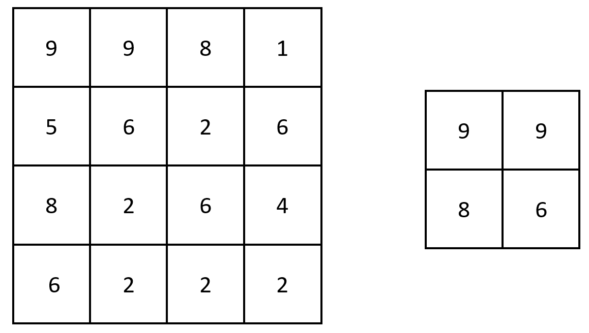
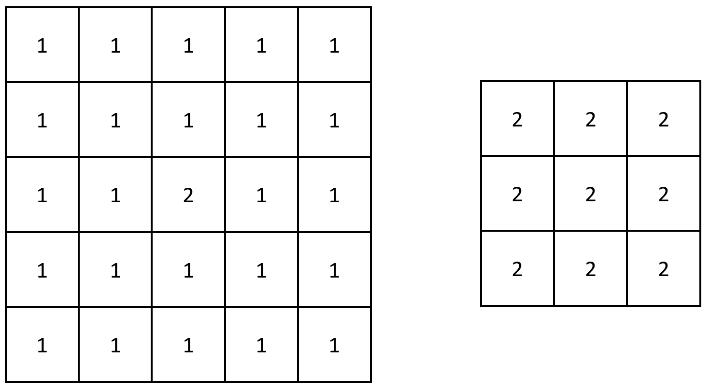

# [2373. Largest Local Values in a Matrix](https://leetcode.com/problems/largest-local-values-in-a-matrix/description/?envType=daily-question&envId=2024-05-12)

You are given an `n x n` integer matrix `grid`.

Generate an integer matrix `maxLocal` of size `(n - 2) x (n - 2)` such that:

- `maxLocal[i][j]` is equal to the largest value of the `3 x 3` matrix in `grid` centered around row `i + 1` and column `j + 1`.

In other words, we want to find the largest value in every contiguous `3 x 3` matrix in `grid`.

Return _the generated matrix._

## Example 1:



```

Input: grid = [[9,9,8,1],[5,6,2,6],[8,2,6,4],[6,2,2,2]]
Output: [[9,9],[8,6]]
Explanation: The diagram above shows the original matrix and the generated matrix.
Notice that each value in the generated matrix corresponds to the largest value of a contiguous 3 x 3 matrix in grid.

```

## Example 2:



```

Input: grid = [[1,1,1,1,1],[1,1,1,1,1],[1,1,2,1,1],[1,1,1,1,1],[1,1,1,1,1]]
Output: [[2,2,2],[2,2,2],[2,2,2]]
Explanation: Notice that the 2 is contained within every contiguous 3 x 3 matrix in grid.

```

## Constraints:

- `n == grid.length == grid[i].length`
- `3 <= n <= 100`
- `1 <= grid[i][j] <= 100`

# Code

```python

class Solution:
    def largestLocal(self, grid: List[List[int]]) -> List[List[int]]:
        n = len(grid)
        m = n - 2
        res = [[0] * m for i in range(m)]

        for i in range(m):
            for j in range(m):
                for k in range(i, i + 3):
                    for l in range(j, j + 3):
                        res[i][j] = max(res[i][j], grid[k][l])


        return res


```
