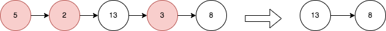

# [2487. Remove Nodes From Linked List](https://leetcode.com/problems/remove-nodes-from-linked-list/description/?envType=daily-question&envId=2024-05-06)

You are given the `head` of a linked list.

Remove every node which has a node with a greater value anywhere to the right side of it.

Return _the `head` of the modified linked list._

## Example 1:



```

Input: head = [5,2,13,3,8]
Output: [13,8]
Explanation: The nodes that should be removed are 5, 2 and 3.
- Node 13 is to the right of node 5.
- Node 13 is to the right of node 2.
- Node 8 is to the right of node 3.

```

## Example 2:

```

Input: head = [1,1,1,1]
Output: [1,1,1,1]
Explanation: Every node has value 1, so no nodes are removed.

```

## Constraints:

- The number of the nodes in the given list is in the range `[1, 105]`.
- `1 <= Node.val <= 105`

# Complexity

- **Time complexity:**
  `O(n)`

- **Space complexity:**
  `O(1)`

# Code

**Stack**%

```python

# Definition for singly-linked list.
# class ListNode:
#     def __init__(self, val=0, next=None):
#         self.val = val
#         self.next = next
class Solution:
    def removeNodes(self, head: Optional[ListNode]) -> Optional[ListNode]:
        stack = []

        while head:
            while stack and stack[-1].val < head.val:
                stack.pop()
            stack.append(head)
            head = head.next

        while len(stack) > 1:
            n = stack.pop()
            stack[-1].next = n

        return stack[-1]

        return head

```

```java

/**
 * Definition for singly-linked list.
 * public class ListNode {
 *     int val;
 *     ListNode next;
 *     ListNode() {}
 *     ListNode(int val) { this.val = val; }
 *     ListNode(int val, ListNode next) { this.val = val; this.next = next; }
 * }
 */
class Solution {
    public ListNode removeNodes(ListNode head) {
        Deque<ListNode> stack = new ArrayDeque<>();

        while (head != null) {
            while (!stack.isEmpty() && stack.peek().val < head.val) {
                stack.pop();
            }
            stack.push(head);
            head = head.next;
        }

        ListNode tail = null;
        while (!stack.isEmpty()) {
            ListNode current = stack.pop();
            current.next = tail;
            tail = current;
        }

        return tail;

    }
}

```

**Reverse**

```python

# Definition for singly-linked list.
# class ListNode:
#     def __init__(self, val=0, next=None):
#         self.val = val
#         self.next = next
class Solution:
    def reverseLinkedList(self, head: Optional[ListNode]) -> Optional[ListNode]:
        tail = None

        while head:
            currentNext = head.next
            head.next = tail
            tail = head
            head = currentNext
        return tail

    def removeNodes(self, head: Optional[ListNode]) -> Optional[ListNode]:

        current = tail = self.reverseLinkedList(head)
        currentMax = current.val

        while current.next:
            if current.next.val < currentMax:
                current.next = current.next.next
            else:
                current = current.next
                currentMax = current.val

        return self.reverseLinkedList(tail)

```

```java

/**
 * Definition for singly-linked list.
 * public class ListNode {
 *     int val;
 *     ListNode next;
 *     ListNode() {}
 *     ListNode(int val) { this.val = val; }
 *     ListNode(int val, ListNode next) { this.val = val; this.next = next; }
 * }
 */
class Solution {
    public ListNode reverse(ListNode head) {
        ListNode tail = null;

        while (head != null) {
            ListNode next = head.next;
            head.next = tail;
            tail = head;
            head = next;
        }

        return tail;
    }
    public ListNode removeNodes(ListNode head) {
        ListNode current = reverse(head);
        ListNode tail = current;
        int max = current.val;

        while (current.next != null ){
            if (current.next.val < max) {
                current.next = current.next.next;
            } else {
                current = current.next;
                max = current.val;
            }
        }

        return reverse(tail);
    }
}

```
