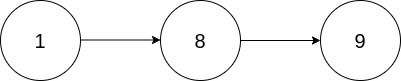
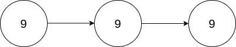

# [2816. Double a Number Represented as a Linked List](https://leetcode.com/problems/double-a-number-represented-as-a-linked-list/description/?envType=daily-question&envId=2024-05-07)

You are given the `head` of a **non-empty** linked list representing a non-negative integer without leading zeroes.

Return _the `head` of the linked list after **doubling** it._

## Example 1:



```

Input: head = [1,8,9]
Output: [3,7,8]
Explanation: The figure above corresponds to the given linked list which represents the number 189. Hence, the returned linked list represents the number 189 * 2 = 378.

```

## Example 2:



```

Input: head = [9,9,9]
Output: [1,9,9,8]
Explanation: The figure above corresponds to the given linked list which represents the number 999. Hence, the returned linked list reprersents the number 999 * 2 = 1998.

```

## Constraints:

- The number of nodes in the list is in the range `[1, 104]`
- `0 <= Node.val <= 9`
- The input is generated such that the list represents a number that does not have leading zeros, except the number `0` itself.

# Complexity

- **Time complexity:**
  `O(n)`

- **Space complexity:**
  `O(n)`

# Code

```python

# Definition for singly-linked list.
# class ListNode:
#     def __init__(self, val=0, next=None):
#         self.val = val
#         self.next = next
class Solution:
    def doubleIt(self, head: Optional[ListNode]) -> Optional[ListNode]:
        stack = []
        carry = 0

        current = head

        while head:
            stack.append(head)
            head = head.next

        tail = None

        while stack:
            cur = stack.pop()
            val = cur.val * 2

            if val >= 10:
                val = val % 10
                cur.val = val + carry
                carry = 1
            else:
                cur.val = val + carry
                carry = 0

            cur.next = tail
            tail = cur

        if carry:
            temp = tail
            tail = ListNode(carry)
            tail.next = temp

        return tail


```
