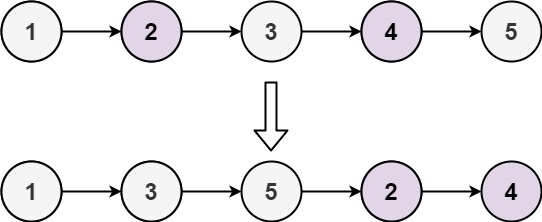
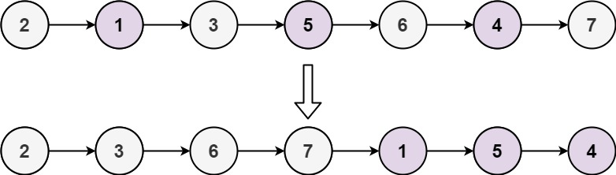

# [328. Odd Even Linked List](https://leetcode.com/problems/odd-even-linked-list/description/)

Given the head of a singly linked list, group all the nodes with odd indices together followed by the nodes with even indices, and return the reordered list.

The first node is considered odd, and the second node is even, and so on.

Note that the relative order inside both the even and odd groups should remain as it was in the input.

You must solve the problem in `O(1)` extra space complexity and `O(n)` time complexity.

## Example 1:



```
Input: head = [1,2,3,4,5]
Output: [1,3,5,2,4]
```

## Example 2:



```
Input: head = [2,1,3,5,6,4,7]
Output: [2,3,6,7,1,5,4]
```

## Constraints:

- The number of nodes in the linked list is in the range `[0, 10^4]`.
- `-10^6 <= Node.val <= 10^6`

```py

from typing import Optional


# Definition for singly-linked list.
class ListNode:
    def __init__(self, val=0, next=None):
        self.val = val
        self.next = next


class Solution:
    def oddEvenList(self, head: Optional[ListNode]) -> Optional[ListNode]:
        if head is None:
            return head

        odd, even = head, head.next
        even_head = even

        while even is not None and even.next is not None:
            odd.next = odd.next.next
            even.next = even.next.next

            odd = odd.next
            even = even.next


        odd.next = even_head

        return head

```

```go
/**
 * Definition for singly-linked list.
 * type ListNode struct {
 *     Val int
 *     Next *ListNode
 * }
 */
func oddEvenList(head *ListNode) *ListNode {
    if head == nil {
        return head
    }

    odd := head
    even := head.Next
    evenHead := even

    for even != nil && even.Next != nil {
        odd.Next = odd.Next.Next
        even.Next = even.Next.Next
        odd = odd.Next
        even = even.Next
    }

    odd.Next = evenHead
    return head
}
```
