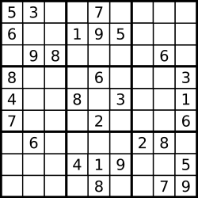

# [36. Valid Sudoku](https://leetcode.com/problems/valid-sudoku/description/)

Determine if a `9 x 9` Sudoku board is valid. Only the filled cells need to be validated **according to the following rules:**

- Each row must contain the digits `1-9` without repetition.
- Each column must contain the digits `1-9` without repetition.
- Each of the nine `3 x 3` sub-boxes of the grid must contain the digits 1-9 without repetition.

**Note:**

- A Sudoku board (partially filled) could be valid but is not necessarily solvable.
- Only the filled cells need to be validated according to the mentioned rules.

## Example 1:



```

Input: board =
[["5","3",".",".","7",".",".",".","."]
,["6",".",".","1","9","5",".",".","."]
,[".","9","8",".",".",".",".","6","."]
,["8",".",".",".","6",".",".",".","3"]
,["4",".",".","8",".","3",".",".","1"]
,["7",".",".",".","2",".",".",".","6"]
,[".","6",".",".",".",".","2","8","."]
,[".",".",".","4","1","9",".",".","5"]
,[".",".",".",".","8",".",".","7","9"]]
Output: true

```

## Example 2:

```

Input: board =
[["8","3",".",".","7",".",".",".","."]
,["6",".",".","1","9","5",".",".","."]
,[".","9","8",".",".",".",".","6","."]
,["8",".",".",".","6",".",".",".","3"]
,["4",".",".","8",".","3",".",".","1"]
,["7",".",".",".","2",".",".",".","6"]
,[".","6",".",".",".",".","2","8","."]
,[".",".",".","4","1","9",".",".","5"]
,[".",".",".",".","8",".",".","7","9"]]
Output: false
Explanation: Same as Example 1, except with the 5 in the top left corner being modified to 8. Since there are two 8's in the top left 3x3 sub-box, it is invalid.

```

## Constraints:

- `board.length == 9`
- `board[i].length == 9`
- `board[i][j]` is a digit `1-9` or `'.'`.

```py

from collections import defaultdict
from typing import List


class Solution:
    def isValidSudoku(self, board: List[List[str]]) -> bool:
        boardMap = defaultdict(list)

        for x in range(9):
            for y in range(9):
                char = board[x][y]
                if char != ".":
                    if char in boardMap:
                        for pos in boardMap[char]:
                            if (
                                (pos[0] == x)
                                or (pos[1] == y)
                                or (pos[0] // 3 == x // 3 and pos[1] // 3 == y // 3)
                            ):
                                return False
                    boardMap[char].append((x, y))

        return True

```

```js
var isValidSudoku = function (board) {
  const map = {};

  for (let i = 0; i < 9; i++) {
    for (let j = 0; j < 9; j++) {
      if (board[i][j] === ".") continue;

      let num = board[i][j],
        x = Math.floor(i / 3),
        y = Math.floor(j / 3);

      let err =
        map["r" + i + num] || map["c" + j + num] || map["b" + x + y + num];

      if (err) return false;

      map["r" + i + num] = 1;
      map["c" + j + num] = 1;
      map["b" + x + y + num] = 1;
    }
  }

  return true;
};
```
