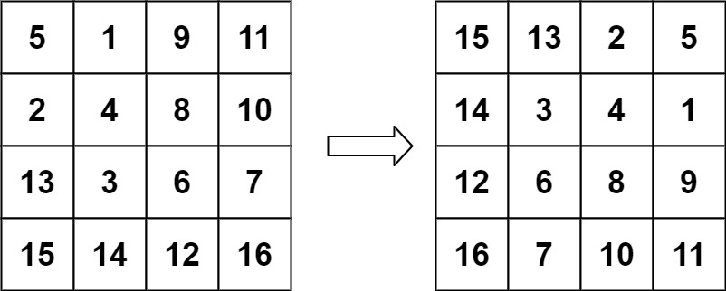

# [48. Rotate Image](https://leetcode.com/problems/rotate-image/description/)

You are given an `n x n` 2D `matrix` representing an image, rotate the image by **90** degrees (clockwise).

You have to rotate the image **in-place**, which means you have to modify the input 2D matrix directly. **DO NOT** allocate another 2D matrix and do the rotation.

## Example 1:


```

Input: matrix = [[1,2,3],[4,5,6],[7,8,9]]
Output: [[7,4,1],[8,5,2],[9,6,3]]

```

## Example 2:



```

Input: matrix = [[5,1,9,11],[2,4,8,10],[13,3,6,7],[15,14,12,16]]
Output: [[15,13,2,5],[14,3,4,1],[12,6,8,9],[16,7,10,11]]

```

## Constraints:

- `n == matrix.length == matrix[i].length`
- `1 <= n <= 20`
- `-1000 <= matrix[i][j] <= 1000`

```py

class Solution:
    def rotate(self, matrix: List[List[int]]) -> None:
        """
        Do not return anything, modify matrix in-place instead.
        """
        self.reverse(matrix)
        self.transpose(matrix)

    def reverse(self, matrix: List[List[int]]) -> None:
        l, r = 0, len(matrix) - 1

        while l < r:
            matrix[l], matrix[r] = matrix[r], matrix[l]
            l += 1
            r -= 1

    def transpose(self, matrix: List[List[int]]) -> None:
        for i in range(len(matrix)):
            for j in range(i):
                matrix[i][j], matrix[j][i] = matrix[j][i], matrix[i][j]

```

```ts
/**
 Do not return anything, modify matrix in-place instead.
 */
function rotate(matrix: number[][]): void {
  reverse(matrix);
  transpose(matrix);
}

function reverse(matrix: number[][]): void {
  let l = 0;
  let r = matrix.length - 1;

  while (l < r) {
    const temp = matrix[l];

    matrix[l] = matrix[r];
    matrix[r] = temp;

    l++;
    r--;
  }
}

function transpose(matrix: number[][]): void {
  for (let i = 0; i < matrix.length; i++) {
    for (let j = 0; j < i; j++) {
      const temp = matrix[i][j];

      matrix[i][j] = matrix[j][i];
      matrix[j][i] = temp;
    }
  }
}
```
