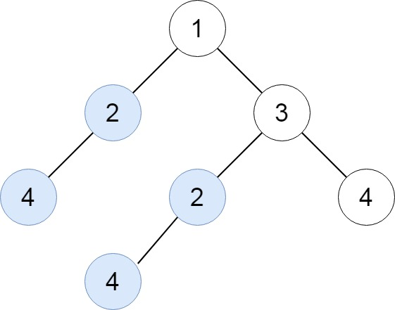
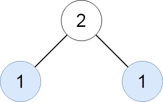
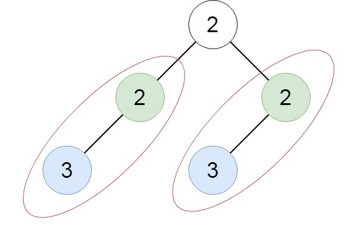

[652. Find Duplicate Subtrees](https://leetcode.com/problems/find-duplicate-subtrees/description/)

Given the root of a binary tree, return all duplicate subtrees.

For each kind of duplicate subtrees, you only need to return the root node of any one of them.

Two trees are duplicate if they have the same structure with the same node values.

**Example 1:**



Input: root = [1,2,3,4,null,2,4,null,null,4]
Output: [[2,4],[4]]

**Example 2:**


Input: root = [2,1,1]
Output: [[1]]

**Example 3:**


Input: root = [2,2,2,3,null,3,null]
Output: [[2,3],[3]]

**Constraints:**

- The number of the nodes in the tree will be in the range `[1, 5000]`
- `-200 <= Node.val <= 200`

## Code

```py

# Definition for a binary tree node.
import collections
from typing import List, Optional


class TreeNode(object):
    def __init__(self, val=0, left=None, right=None):
        self.val = val
        self.left = left
        self.right = right

class Solution:
    def findDuplicateSubtrees(
        self, root: Optional[TreeNode]
    ) -> List[Optional[TreeNode]]:
        ans = []
        count = collections.Counter()

        def encode(root: Optional[TreeNode]) -> str:
            if not root:
                return ""

            encoded = str(root.val) + "#" + encode(root.left) + "#" + encode(root.right)
            count[encoded] += 1
            if count[encoded] == 2:
                ans.append(root)
            return encoded

        encode(root)
        return ans

```
