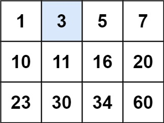

# [74. Search a 2D Matrix](https://leetcode.com/problems/search-a-2d-matrix/description/)

You are given an `m x n` integer matrix matrix with the following two properties:

- Each row is sorted in non-decreasing order.
- The first integer of each row is greater than the last integer of the previous row.

Given an integer target, return `true` if `target` is in matrix or `false` otherwise.

You must write a solution in `O(log(m * n))` time complexity.

## Example 1:



```

Input: matrix = [[1,3,5,7],[10,11,16,20],[23,30,34,60]], target = 3
Output: true

```

## Example 2:


```

Input: matrix = [[1,3,5,7],[10,11,16,20],[23,30,34,60]], target = 13
Output: false

```

## Constraints:

- `m == matrix.length`
- `n == matrix[i].length`
- `1 <= m, n <= 100`
- `-10^4 <= matrix[i][j], target <= 10^4`

# Code

```py

class Solution:
    def searchMatrix(self, matrix: List[List[int]], target: int) -> bool:
        for row in matrix:
            isInRow = self.binarySearch(row, target)
            if isInRow:
                return True
        return False

    def binarySearch(self, row: List[int], target: int) -> bool:
        n = len(row)

        l, r = 0, n - 1

        while l <= r:
            mid = int(l + (r - l) / 2)

            if row[mid] == target:
                return True
            if row[mid] < target:
                l = mid + 1
            else:
                r = mid - 1

        return False

```

```ts
function searchMatrix(matrix: number[][], target: number): boolean {
  const n = matrix.length;
  const m = matrix[0].length;
  let row = 0;
  let col = m - 1;

  while (row < n && col >= 0) {
    if (matrix[row][col] === target) {
      return true;
    }

    if (matrix[row][col] > target) {
      col--;
    } else {
      row++;
    }
  }

  return false;
}
```
