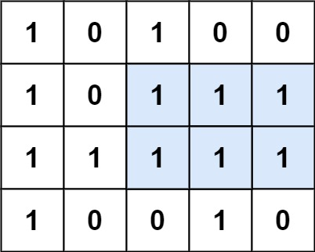

# [85. Maximal Rectangle](https://leetcode.com/problems/maximal-rectangle/description/?envType=daily-question&envId=2024-04-13)

Given a `rows x cols` binary `matrix` filled with 0's and 1's, find the largest rectangle containing only `1`'s and return _its area_.

## Example 1:



```
Input: matrix = [["1","0","1","0","0"],["1","0","1","1","1"],["1","1","1","1","1"],["1","0","0","1","0"]]
Output: 6
Explanation: The maximal rectangle is shown in the above picture.
```

## Example 2:

```
Input: matrix = [["0"]]
Output: 0
```

## Example 3:

```
Input: matrix = [["1"]]
Output: 1
```

## Constraints:

- `rows == matrix.length`
- `cols == matrix[i].length`
- `1 <= row, cols <= 200`
- `matrix[i][j]` is `'0'` or `'1'`.

```python

class Solution:
    def maximalRectangle(self, matrix: List[List[str]]) -> int:
        if not matrix:
            return 0

        rows, cols = len(matrix), len(matrix[0])
        heights = [0] * (cols + 1)
        max_area = 0

        for row in matrix:
            for i in range(cols):
                heights[i] = heights[i] + 1 if row[i] == '1' else 0

            stack = []
            for i in range(len(heights)):
                while stack and heights[i] < heights[stack[-1]]:
                    h = heights[stack.pop()]
                    w = i if not stack else i - stack[-1] - 1
                    max_area = max(max_area, h * w)
                stack.append(i)

        return max_area

```
