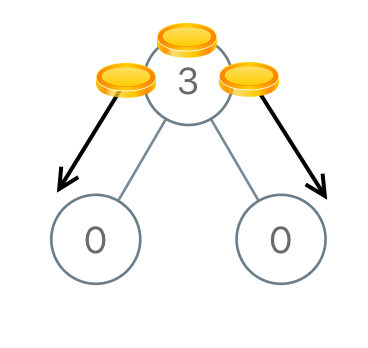
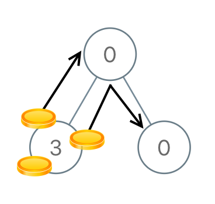

# [979. Distribute Coins in Binary Tree](https://leetcode.com/problems/distribute-coins-in-binary-tree/description/?envType=daily-question&envId=2024-05-18)

You are given the root of a binary tree with `n` nodes where each `node` in the tree has `node.val` coins. There are `n` coins in total throughout the whole tree.

In one move, we may choose two adjacent nodes and move one coin from one node to another. A move may be from parent to child, or from child to parent.

Return _the **minimum** number of moves required to make every node have **exactly** one coin._

## Example 1:



```
Input: root = [3,0,0]
Output: 2
Explanation: From the root of the tree, we move one coin to its left child, and one coin to its right child.
```

## Example 2:



```
Input: root = [0,3,0]
Output: 3
Explanation: From the left child of the root, we move two coins to the root [taking two moves]. Then, we move one coin from the root of the tree to the right child.
```

## Constraints:

- The number of nodes in the tree is `n`.
- `1 <= n <= 100`
- `0 <= Node.val <= n`
- The sum of all `Node.val` is `n`.

# Code

```python

# Definition for a binary tree node.
# class TreeNode:
#     def __init__(self, val=0, left=None, right=None):
#         self.val = val
#         self.left = left
#         self.right = right
class Solution:
    def distributeCoins(self, root: Optional[TreeNode]) -> int:
        res = 0

        if root.left:
            res += self.distributeCoins(root.left)
            root.val += root.left.val - 1
            res += abs(root.left.val - 1)
        if root.right:
            res += self.distributeCoins(root.right)
            root.val += root.right.val - 1
            res += abs(root.right.val - 1)
        return res

```

```python

# Definition for a binary tree node.
# class TreeNode:
#     def __init__(self, val=0, left=None, right=None):
#         self.val = val
#         self.left = left
#         self.right = right
class Solution:
    res = 0
    def distributeCoins(self, root: Optional[TreeNode]) -> int:
        self.dfs(root)
        return self.res

    def dfs(self, root: Optional[TreeNode]):
        if root == None:
            return 0

        left = self.dfs(root.left)
        right = self.dfs(root.right)
        self.res +=  abs(left) + abs(right)
        return root.val + left + right - 1

```
