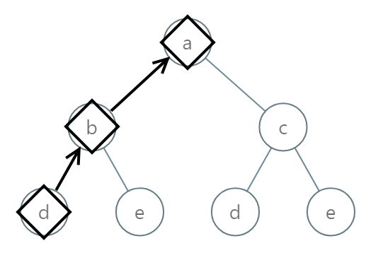
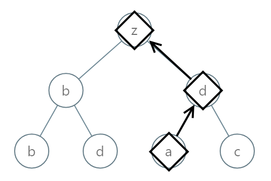
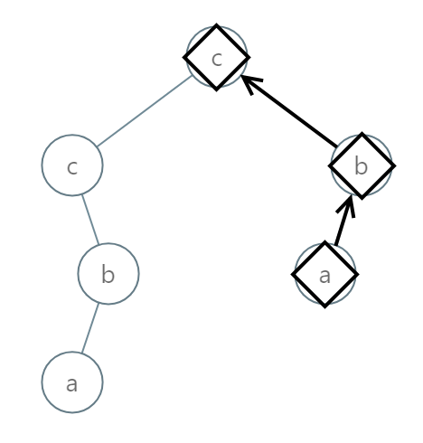

# [988. Smallest String Starting From Leaf](https://leetcode.com/problems/smallest-string-starting-from-leaf/description/)

You are given the `root` of a binary tree where each node has a value in the range `[0, 25]` representing the letters `'a'` to `'z'`.

Return _the **lexicographically smallest** string that starts at a leaf of this tree and ends at the root._

As a reminder, any shorter prefix of a string is **lexicographically smaller**.

- For example, `"ab"` is lexicographically smaller than `"aba"`.

A leaf of a node is a node that has no children.

## Example 1:



```
Input: root = [0,1,2,3,4,3,4]
Output: "dba"
```

## Example 2:



```
Input: root = [25,1,3,1,3,0,2]
Output: "adz"
```

## Example 3:



```
Input: root = [2,2,1,null,1,0,null,0]
Output: "abc"
```

## Constraints:

- The number of nodes in the tree is in the range `[1, 8500]`.
- `0 <= Node.val <= 25`

# Code

```python

# Definition for a binary tree node.
# class TreeNode:
#     def __init__(self, val=0, left=None, right=None):
#         self.val = val
#         self.left = left
#         self.right = right
class Solution:
    def smallestFromLeaf(self, root: Optional[TreeNode]) -> str:
        def dfs(node, path, smallest):
            if not node:
                return

            path.append(chr(node.val + ord('a')))

            if not node.left and not node.right:
                current_string = ''.join(path[::-1])
                smallest[0] = min(smallest[0], current_string)

            dfs(node.left, path, smallest)
            dfs(node.right, path, smallest)

            path.pop()

        smallest = [chr(ord('z') + 1)]

        dfs(root, [], smallest)

        return smallest[0]

```
